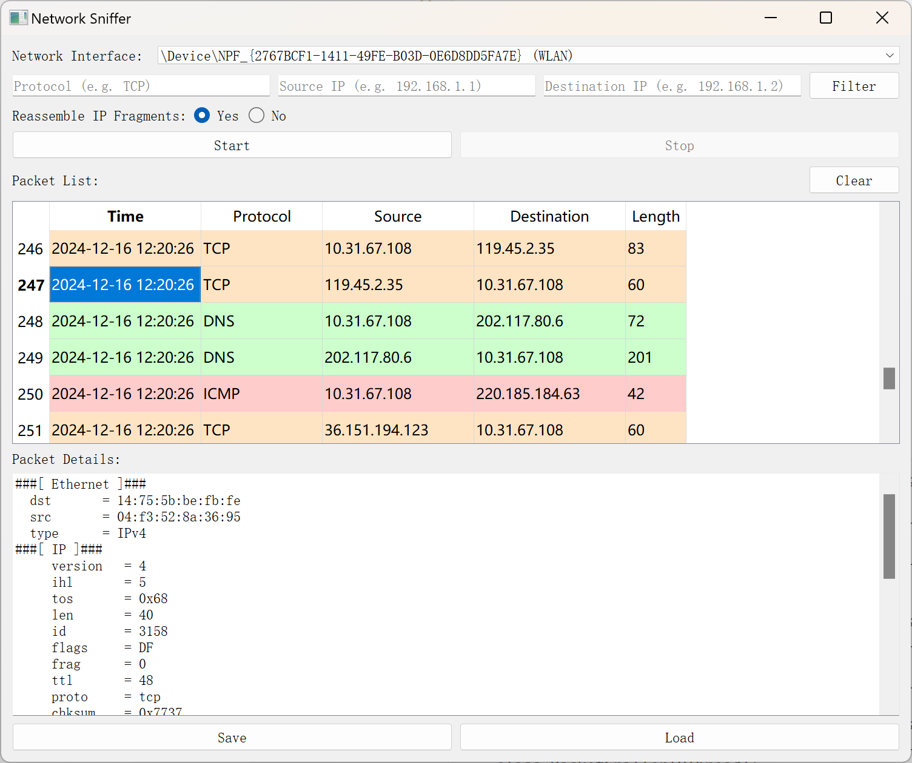

# Network Sniffer

### 软件目标

设计并实现一个 sniffer 工具，能够抓取流经指定网卡的数据并进行分析，具体技术指标要求如下：

1. 如果主机有多块网卡，用户可选定网卡；

2. 按照协议类型、源地址和目的地址过滤、查找数据帧（分组或数据段）；

3. 实现 IP 分片的重组；

4. 支持分析结果的保存与读取；

5. 解析以太数据帧、IPv4、TCP、UDP、HTPP、ARP、ICMP 协议数据；

提交材料要求：

1.可运行的 sniffer 工具（包含可执行文件、源代码、使用配置说明）；

2.Sniffer 工具的技术报告（报告包含设计、实现和测试各阶段的内容）。

### 环境配置

访问[https://npcap.com/]()，下载并安装Npcap。在安装过程中，确保勾选 Install Npcap in WinPcap API-compatible Mode 选项。这将确保 Npcap 的 API 与 WinPcap 兼容，从而让 scapy 能正常使用。

安装Python开发环境，该软件在Python3.10版本中测试通过。

在终端输入如下指令安装Python依赖包：

```shell
pip install -r requirements.txt
```

### 运行

在终端输入如下指令即可运行：

```shell
python sniffer.py
```

### 界面重设计

用Qt Designer打开`sniffer.ui`设计，在终端运行以下指令将.ui文件转换为.py文件，即可对界面进行重设计。

```bash
pyuic5 -x sniffer.ui -o ui.py
```

### 界面演示



### 计划表

区分MAC和IP地址，Protocol用最高层协议

### Acknowledgement